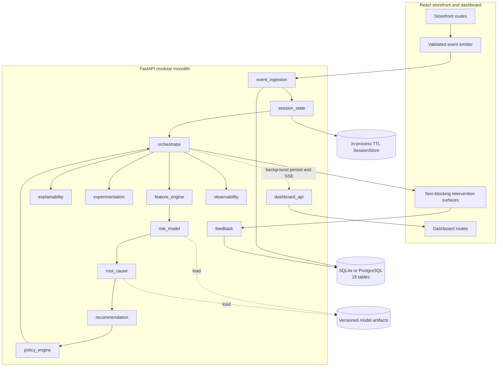
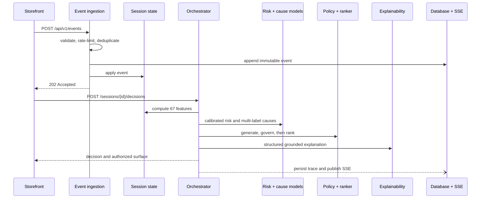

# Architecture

The application is one React/Vite frontend and one FastAPI modular monolith. SQLite is the offline default; the SQLAlchemy models and Alembic migrations also support PostgreSQL through `DATABASE_URL`.

The synchronous decision path never calls an LLM. Optional prose rendering and review summarization have deterministic template fallbacks. `RANKER_STRATEGY=rules` is deterministic; the optional `bandit` strategy only reorders candidates that have already passed policy.

## Reliability boundaries

- Missing risk artifacts yield `ABSTAIN`; readiness returns 503 while liveness stays 200.
- Missing root-cause artifacts yield `UNKNOWN` without hiding the risk result.
- SessionStore eviction rebuilds state from the immutable event stream.
- Trace persistence is after the response and cannot fail the customer decision.
- Duplicate events are ignored by primary-key conflict handling.
- Events and decisions are limited per session to 100/min and 20/min.

## Production evolution (not implemented)

Replace the in-process SessionStore with Redis, the internal event fan-out with Kafka, and SQLite with managed PostgreSQL. Add authentication, distributed rate limiting, separate model serving, and reviewed drift-triggered retraining. These are deployment changes behind current module interfaces, not demo requirements.
