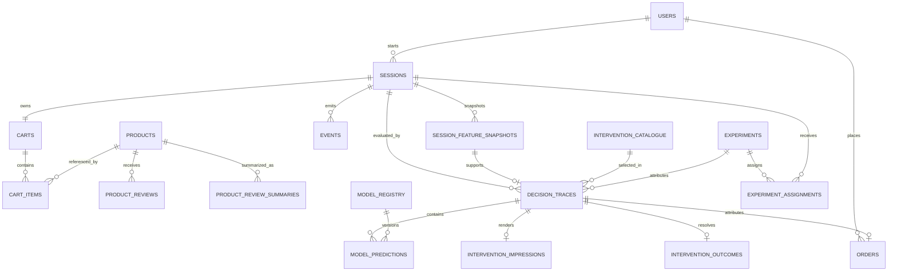

# Data model

Alembic owns 18 application tables. JSON columns are portable SQLAlchemy `JSON`, not PostgreSQL-only JSONB, so the same migrations run on SQLite and PostgreSQL.

| Table | Primary key | Purpose |
|---|---|---|
| `users` | `user_id` | Synthetic customer history and priors |
| `products` | `product_id` | Seeded product facts and price history |
| `product_reviews` | `review_id` | Grounding source reviews |
| `product_review_summaries` | `summary_id` | Cached summaries with source IDs |
| `sessions` | `session_id` | Session lifecycle and final outcome |
| `carts` | `cart_id` | Persisted cart header |
| `cart_items` | `cart_item_id` | Active/historical cart lines |
| `events` | `event_id` | Immutable, sequenced behavioral log |
| `intervention_catalogue` | `intervention_id` | Governed 12-action catalogue |
| `experiments` | `experiment_id` | Experiment definition and budget |
| `model_registry` | `model_id` | Version, artifact and promotion status |
| `decision_traces` | `decision_id` | Complete decision/audit trail |
| `session_feature_snapshots` | `snapshot_id` | Versioned 67-feature vectors |
| `model_predictions` | `prediction_id` | Risk/cause outputs and latency |
| `intervention_impressions` | `impression_id` | Exactly-once shown record |
| `intervention_outcomes` | `outcome_id` | Click, dismiss, conversion and margin |
| `orders` | `order_id` | Simulated completed purchase |
| `experiment_assignments` | `assignment_id` | Stable session-to-arm mapping |

Important invariants include unique `(session_id, sequence_no)`, one active model per model type, one assignment per experiment/session, one impression/outcome per decision, foreign keys enabled on SQLite, and closed enum/check constraints for decisions, channels, events and statuses.
